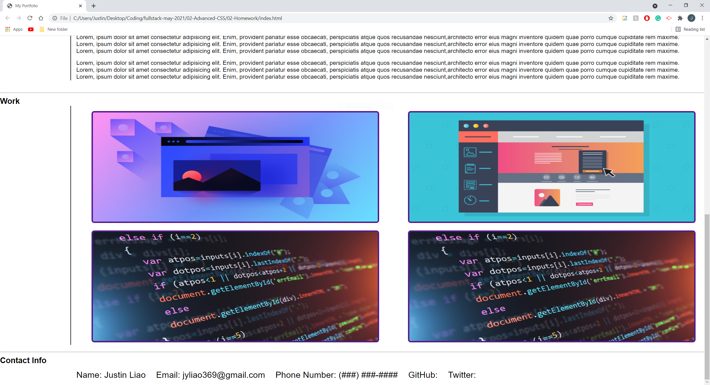

# My-Portfolio - HW 2

# Overview
This project/activity is for developers that already have a basic understanding of HTML and CSS. The projects primary function is to give developers a chance to use the knowledge they learn on HTML and CSS to create a personalized portolio of themselves. In the portfolio, it will give recuriters and organizations to learn about the developer and see what kind of projects they have created over through their career. This project gives companies a chance to see what the individual developer can do and potentially do if hired.

For now, the portfolio will be very basic as the developer will only know the basics of HTML and CSS, but this project will give them plenty of experience creating and portfolio from scratch as well as customize and stylize that fits to their likeness. In addition, the project will also emphasize on responsive web design. Since web applications are used in nearly every capacity like phones and tablets, the developer must keep in mind how their applications will translate from desktop to phones and tablets.

## Goal/Objective

The goal of this activity is to give the developers a chance to use the knowledge they have learned in both HTML and CSS and use that knowledge to create a portfolio from scratch. They will create a HTML file withe the necessary sections that can help recruiters and companies get a picture of the developers skill in HTML and in CSS. Along the way, developers will make adjustments to their portfolio in order to make them respnsive based on different resolutions and if a user is viewing the portfolio on a tablet or a phone.

## New Key Topics

* CSS
  * Responsiveness
  * Media Query
  * Pseudo Classes

## Learning Objects

* Learning to build a web application from scratch.
* Learning to stylize the web application with CSS from scratch.
* Attaching certain links to the images and having those links take the user to a specific website. In this case, previous applications the developer has made.
* Learning how to adjust the web application to be responsive through CSS adjustments as well as media queries.

## Screenshots

